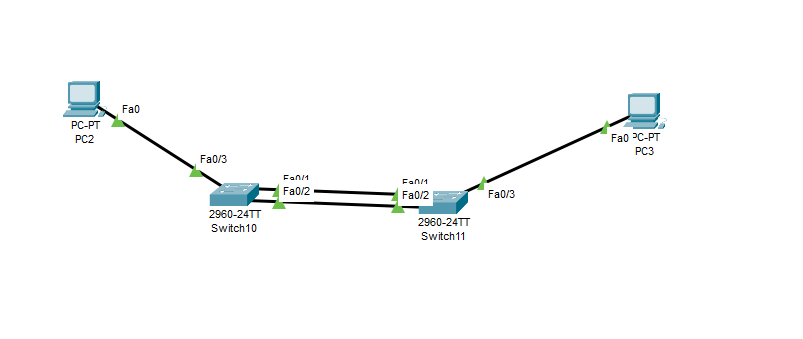

# Layer 2 EtherChannel i RSTP Mrežni Dizajn

Praktični Cisco Packet Tracer projekat fokusiran na implementaciju, verifikaciju i analizu **Layer 2 EtherChannel-a (statički način rada)** i **Rapid Per-VLAN Spanning Tree Protocol-a (RPVST+)**. Projekat demonstrira izgradnju redundantne, brze i stabilne mrežne infrastrukture bez petlji, kakva se koristi u poslovnim i bankarskim okruženjima.


---

## Arhitektura Projekta i Ključni Koncepti

Ova laboratorijska vježba analizira ponašanje redundantnih veza između mrežnih prekidača (switch-eva) i prikazuje kako savremeni Spanning Tree protokoli upravljaju mrežnim petljama, optimizuju korištenje resursa i obezbjeđuju rezervne komunikacione putanje.

### Tehnologije korištene u projektu

### 🔹 Layer 2 EtherChannel (statički `mode on`)

EtherChannel omogućava spajanje više fizičkih linkova u jedan logički kanal (`Port-Channel`). Na taj način povećava se propusni opseg i postiže veća otpornost na kvarove.

**Prednosti:**

* Agregacija više fizičkih linkova u jedan logički link.
* Veća ukupna propusnost.
* Brži oporavak u slučaju otkaza jednog od linkova.
* Jednostavnije upravljanje redundantnim vezama.

Primjer:

1 Gbps + 1 Gbps = 2 Gbps ukupne propusnosti

---

### Cisco RPVST+ (Rapid Per-VLAN Spanning Tree)

RPVST+ predstavlja Cisco implementaciju standarda IEEE 802.1w i omogućava:

* Bržu konvergenciju mreže.
* Posebnu Spanning Tree instancu za svaki VLAN.
* Efikasno uklanjanje Layer 2 petlji.
* Održavanje redundantnih putanja bez prekida komunikacije.

---

### Izbor Root Bridge uređaja

Za optimalan protok saobraćaja potrebno je unaprijed definisati koji switch će biti:

* **Primary Root Bridge**
* **Secondary Root Bridge**

Time se izbjegava nasumičan izbor Root Bridge uređaja i osigurava predvidljivo ponašanje mreže.

---

## Konfiguracija

### 1. Konfiguracija EtherChannel-a (Static Mode)

Na oba switch-a koji su povezani redundantnim linkovima izvršena je sljedeća konfiguracija:

```cisco
Switch# configure terminal
Switch(config)# interface range fa0/1 - 2
Switch(config-if-range)# channel-group 1 mode on
Switch(config-if-range)# exit
```

Navedena konfiguracija grupiše interfejse **Fa0/1** i **Fa0/2** u EtherChannel grupu broj 1 bez korištenja LACP ili PAgP pregovaranja.

---

### 2. Optimizacija Spanning Tree Protokola

Da bi mreža koristila optimalne putanje, definisani su Root Bridge uređaji.

#### Primary Root Bridge

```cisco
SW-CORE-01(config)# spanning-tree vlan 1 root primary
```

Automatski postavlja prioritet na **24576** i određuje switch kao glavni Root Bridge.

---

#### Secondary Root Bridge

```cisco
SW-CORE-02(config)# spanning-tree vlan 1 root secondary
```

Automatski postavlja prioritet na **28672** i određuje switch kao rezervni Root Bridge.

---

## Verifikacija i Otklanjanje Problema

Nakon konfiguracije potrebno je provjeriti ispravnost rada EtherChannel-a i RPVST+ protokola.

### Provjera EtherChannel-a

```cisco
Switch# show etherchannel summary
```

Očekivani rezultat:

* **SU**

  * S = Layer 2 EtherChannel
  * U = Port-Channel je aktivan i koristi se

* **P**

  * Interfejs je uspješno pridružen EtherChannel grupi

Primjer:

```text
Group  Port-channel  Protocol  Ports
------+-------------+---------+----------------------
1      Po1(SU)      -         Fa0/1(P) Fa0/2(P)
```

---

### Provjera Spanning Tree-a

```cisco
Switch# show spanning-tree vlan 1
```

Ova komanda omogućava provjeru:

* Aktivnog STP protokola (RSTP).
* Root Bridge uređaja.
* Prioriteta switch-eva.
* Root Port i Designated Port uloga.
* VLAN ID ekstenzije u Bridge ID polju.

---
